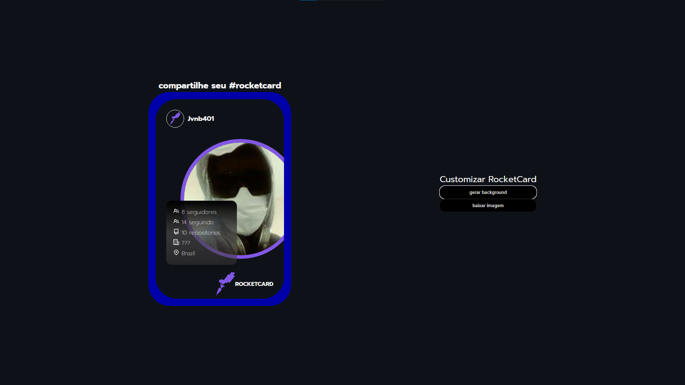

# rocketCard
um site que cria cards usado a api do github e a biblioteca [dom-to-image](https://github.com/tsayen/dom-to-image)  
tela de login (onde coloca o apelido do usuario do github):

 
 
tela de customização e download (usando os dados do github para gerar o html e a dom-to-image para transformar em imagem e baixá-la):

